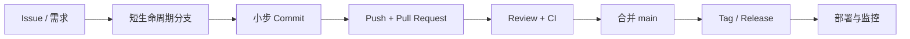
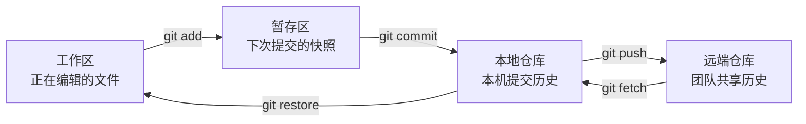
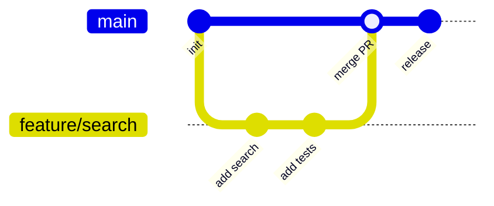
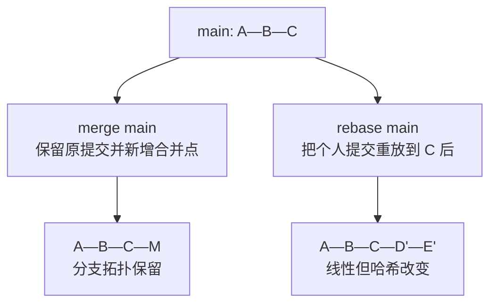

# 🎯 企业真实开发 Git 实战：从工单到上线

Git 命令并不难，真正有门槛的是在多人协作中知道“此刻应该改什么、提交什么、能不能改历史”。本教程以 TeamFlow 工单管理器为训练项目，把日常开发、代码评审、冲突处理和发布串成一条完整链路。

你不需要一次背完命令。先按第 1～6 章完成一次功能交付，再用后面的故障演练建立安全感。所有练习都可以在个人分支完成，不会破坏 `main`。

| 章节 | 核心问题 | 完成标志 |
|---|---|---|
| 0. 全景图 | 企业为什么这样使用 Git？ | 能说清本地与远端的关系 |
| 1. 准备项目 | 怎样得到一个可工作的环境？ | 7 个测试通过 |
| 2. 日常开发 | 上班第一步到下班前做什么？ | 完成一个规范提交 |
| 3. PR 与 Review | 代码如何安全进入主分支？ | 能创建并更新 PR |
| 4. 同步与冲突 | 别人的改动撞上自己怎么办？ | 独立解决一次冲突 |
| 5. 撤销与救火 | 操作错了怎样恢复？ | 会按场景选择命令 |
| 6. 发布 | Git 如何支撑上线与回滚？ | 创建一个版本标签 |
| 7. 毕业任务 | 能否独立完成一次交付？ | 完成搜索功能 PR |

---

## 🗺️ 0. 企业 Git 协作全景

一个企业功能不是“写完代码然后 push”，而是带着需求编号经过多个质量关卡。



| 环节 | 主要责任 | 留下的证据 |
|---|---|---|
| Issue | 产品、开发明确范围和验收标准 | 问题、优先级、负责人 |
| Branch | 隔离尚未完成的工作 | 独立提交序列 |
| Commit | 记录一个可解释的变化 | 作者、时间、差异、原因 |
| Pull Request | 讨论、评审和自动检查 | Review、CI 结果、决策 |
| Main | 保存随时可发布的集成结果 | 受保护的稳定历史 |
| Tag / Release | 标记实际交付版本 | 版本号、变更说明、制品 |

> 💡 **一句话总结**：Git 保存代码演进历史，GitHub 承载团队协作流程；企业真正管理的是“变更如何被证明是安全的”。

### 0.1 四个区域必须分清

写代码时，内容会在工作区、暂存区、本地仓库和远端仓库之间移动。



`git add` 不是“通知 Git 文件存在”，而是精确选择下一次提交包含哪些改动。企业开发中经常只暂存本次需求相关的两个文件，把调试日志或另一项未完成工作留在工作区。

```bash
git status
git diff
git add src/teamflow/service.py tests/test_service.py
git diff --staged
git commit -m "feat: add ticket search"
```

提交前始终看一次 `git diff --staged`。这一步可以挡住临时日志、密钥、无关格式化和误删文件。

### 0.2 Git 保存的是快照和关系

每个提交指向一个项目快照、作者信息和父提交。分支只是指向某个提交的可移动名字，因此创建分支非常轻量。



`HEAD` 表示当前检出的提交，通常通过当前分支间接指向它。理解这一点后，`switch`、`reset`、`rebase` 就不再像魔法。

---

## 🧰 1. 准备训练项目

### 1.1 克隆与首次检查

在新的目录中执行：

```bash
git clone https://github.com/broshenn/git-learning.git
cd git-learning
git status
git remote -v
git log --oneline --graph --decorate --all
```

预期看到当前位于 `main`、工作区干净，远端名为 `origin`。`origin` 只是远端地址的默认别名，不是特殊关键字。

安装项目并运行测试：

```powershell
python -m pip install -e .
./scripts/check.ps1
```

Linux 或 macOS 使用：

```bash
python -m pip install -e .
./scripts/check.sh
```

预期结果是 7 个测试通过。先证明基线正常，后续失败才可以归因于自己的改动。

### 1.2 配置提交身份

身份会永久写入每个提交，但不要把公司配置盲目设为全局。个人电脑可使用 `--global`，公司项目可以只在当前仓库配置。

```bash
git config user.name "你的名字"
git config user.email "你的企业邮箱"
git config --list --show-origin
```

推荐配置：

```bash
git config --global init.defaultBranch main
git config --global fetch.prune true
git config --global pull.ff only
git config --global core.autocrlf true
```

其中 `pull.ff only` 会拒绝偷偷生成意外的 merge commit，逼你先看清分支关系。Windows 常用 `core.autocrlf true`，团队也可以用 `.gitattributes` 统一换行策略。

### 1.3 先会运行项目

```bash
teamflow add "修复登录超时问题" --priority high
teamflow assign 1 "你的名字"
teamflow list --status open
teamflow close 1
```

运行数据写入 `data/tickets.json`，该文件已被 `.gitignore` 排除。业务数据、虚拟环境、密钥和构建产物通常不应该进入代码仓库。

---

## 🌿 2. 一次真实的日常开发

本节模拟 Issue：“列表命令需要按负责人过滤”。先从最新主分支创建功能分支。

### 2.1 每天开始工作的标准动作

```bash
git switch main
git fetch origin
git pull --ff-only
git switch -c feature/filter-by-owner
```

`fetch` 只下载远端状态，不修改工作区；`pull` 通常等于 `fetch` 后再集成。先 `fetch` 更容易观察远端变化，脚本化场景可直接使用 `pull --ff-only`。

分支命名表达意图：

| 前缀 | 使用场景 | 例子 |
|---|---|---|
| `feature/` | 新功能 | `feature/filter-by-owner` |
| `fix/` | 普通缺陷 | `fix/empty-title` |
| `hotfix/` | 线上紧急修复 | `hotfix/json-crash` |
| `docs/` | 只有文档 | `docs/install-guide` |
| `refactor/` | 行为不变的重构 | `refactor/storage-port` |

### 2.2 编码时怎样形成好提交

先查看状态和差异：

```bash
git status --short
git diff
```

只暂存同一意图的文件：

```bash
git add src/teamflow/service.py tests/test_service.py
git diff --staged
git commit -m "feat: filter tickets by owner"
```

一个好提交应满足：

- 只表达一个意图，能够独立解释和回退
- 代码与对应测试尽量在同一提交
- 提交后项目仍能构建、测试
- 信息说明“为什么或实现了什么”，不写“改代码”“update”

推荐 Conventional Commits：

```text
<type>(可选范围): <简短祈使句>

可选正文：解释动机、约束和取舍

可选页脚：Closes #12
```

真实示例：

```text
feat(cli): filter tickets by owner
fix(storage): keep database intact when serialization fails
test(service): cover closed ticket assignment
docs: add Windows installation steps
```

### 2.3 一项需求需要几个提交

没有固定数字。把“评审者能否逐步理解、单独回退”当判断标准。一个小功能常见为 1～3 个提交：

```text
feat: add owner filter to ticket service
feat: expose owner filter in CLI
test: cover owner filtering edge cases
```

如果三个修改必须同时存在才能通过测试，也可以合成一个完整提交。不要为了追求小而留下无法运行的中间状态。

### 2.4 推送分支

```bash
./scripts/check.ps1
git push -u origin HEAD
```

`-u` 建立本地分支与远端分支的跟踪关系，之后可直接 `git push`。`HEAD` 避免重复输入当前分支名。

---

## 🔍 3. Pull Request 与 Code Review

Pull Request 不是合并按钮，而是变更进入公共主线前的质量证明。一个合格 PR 应当让不在场的人也能理解改动。

### 3.1 PR 应写什么

仓库已经提供模板，填写四类信息：

- 变更说明：解决什么用户问题
- 关联任务：使用 `Closes #编号` 自动关闭 Issue
- 验证方式：执行过什么测试，结果是什么
- 风险与回滚：影响面、兼容性和恢复方案

推荐标题与最终提交同样清晰：

```text
feat: support filtering tickets by owner
```

不要把重构、功能、格式化和依赖升级塞进一个 PR。评审范围越杂，漏掉问题的概率越高。

### 3.2 Review 意见如何处理

收到修改建议后继续在同一分支提交：

```bash
git add src/teamflow/service.py tests/test_service.py
git commit -m "fix: normalize owner filter input"
git push
```

不要在每条意见后使用 `git push --force`。PR 合并前如果团队要求整洁历史，可通过 GitHub 的 Squash and merge 把多个修正提交压成一个。

Review 讨论的是代码，不是人。作者应回复“已修改，新增空字符串用例”；评审者应指出可观察的问题和建议，不写模糊的“这里不好”。

### 3.3 三种合并策略

| 策略 | 历史形态 | 适合场景 | 主要代价 |
|---|---|---|---|
| Merge commit | 保留分支与全部提交 | 需要完整开发脉络 | 主线图可能较复杂 |
| Squash merge | 一个 PR 变一个提交 | 小功能、团队主线整洁 | 丢失 PR 内提交边界 |
| Rebase merge | 提交线性重放到主线 | 提交本身质量高 | 提交哈希会变化 |

本训练仓库保留了一次 merge commit，运行下面命令观察：

```bash
git log --oneline --graph --decorate --all
```

企业没有唯一正确策略，关键是仓库统一。常见选择是：普通功能使用 Squash merge，重要长期分支使用 merge commit，个人分支同步主线时使用 rebase。

---

## 🔄 4. 同步主线与解决冲突

冲突不是 Git 损坏，而是 Git 无法替团队决定两份修改哪一份才符合业务。解决冲突本质上是一次代码设计决策。

### 4.1 Merge 与 Rebase 的区别



个人功能分支尚未共享或只有自己使用时：

```bash
git fetch origin
git rebase origin/main
```

已被多人共同使用的分支，优先 merge，避免改写别人依赖的提交哈希：

```bash
git fetch origin
git merge origin/main
```

> 💡 **团队边界**：可以整理自己的未共享历史，不要擅自改写公共历史。

### 4.2 仓库内置冲突实验

远端准备了两条从同一基线出发的实验分支，它们修改同一行。拉取后执行：

```bash
git fetch origin
git switch -c practice/resolve-conflict origin/lab/conflict-alice
git merge origin/lab/conflict-bob
```

Git 会暂停并标记冲突。先看状态：

```bash
git status
git diff
```

冲突文件中会出现：

```text
< < < < < < < HEAD
Alice 分支的内容
= = = = = = =
Bob 分支的内容
> > > > > > > origin/lab/conflict-bob
```

实际文件中的七个符号之间没有空格。理解两边意图，编辑成最终正确版本，并删除所有标记：

```bash
git add src/teamflow/cli.py
git commit -m "merge: resolve CLI description conflict"
./scripts/check.ps1
```

查看结果：

```bash
git log --oneline --graph --decorate --all -12
```

如果发现合并方向错了，在提交前可以安全取消：

```bash
git merge --abort
```

rebase 冲突的编辑过程相同，但解决后使用：

```bash
git add <冲突文件>
git rebase --continue
```

放弃则使用 `git rebase --abort`。

### 4.3 降低冲突概率

- 分支保持短命，最好 1～3 天完成
- 每天同步主线，不等 PR 最后一天才合并
- 一个 PR 聚焦一个需求
- 大规模重命名或格式化提前通知团队
- 先拆公共接口，再并行实现不同模块

---

## 🛟 5. 撤销、恢复与线上救火

看到错误后先运行 `git status` 和 `git log --oneline -10`，确认错误位于哪个区域。不要条件反射执行 `reset --hard`。

### 5.1 场景选择表

| 错误发生在哪里 | 目标 | 推荐命令 | 影响 |
|---|---|---|---|
| 工作区，未暂存 | 丢弃单文件修改 | `git restore <file>` | 文件不可恢复 |
| 暂存区 | 取消暂存并保留修改 | `git restore --staged <file>` | 安全 |
| 最近本地提交 | 补文件或改信息 | `git commit --amend` | 改写本地历史 |
| 最近本地提交 | 拆掉提交并保留修改 | `git reset --mixed HEAD~1` | 改写本地历史 |
| 已推送提交 | 公开地撤销影响 | `git revert <commit>` | 新增反向提交 |
| 工作被打断 | 临时收起所有修改 | `git stash push -u -m "说明"` | 稍后可恢复 |
| 某分支已有修复 | 只拿一个提交 | `git cherry-pick <commit>` | 创建等价新提交 |

### 5.2 暂存错文件

```bash
git restore --staged data/example.json
git status
```

文件仍在工作区，只是不进入下次提交。若它永远不应提交，再补充 `.gitignore`。

### 5.3 已推送错误提交

公共历史使用 `revert`：

```bash
git switch main
git pull --ff-only
git switch -c fix/revert-bad-change
git revert <错误提交哈希>
git push -u origin HEAD
```

然后照常创建 PR。反向提交保留了“曾上线、后来撤销”的审计记录。

### 5.4 紧急修复

线上故障应从当前生产基线或 `main` 创建最小修复：

```bash
git switch main
git pull --ff-only
git switch -c hotfix/json-corruption
# 修改并补回归测试
./scripts/check.ps1
git add src/teamflow/repository.py tests/test_service.py
git commit -m "fix: preserve database on serialization failure"
git push -u origin HEAD
```

即使紧急也应经过最小 Review 和 CI。发布修复后，把同一修复同步到仍在维护的发布分支；必要时使用 `cherry-pick`，但要记录来源。

### 5.5 找回“消失”的提交

只要 Git 尚未清理对象，`reflog` 通常能找到移动前的 `HEAD`：

```bash
git reflog
git show <找到的哈希>
git switch -c rescue/lost-work <找到的哈希>
```

先创建救援分支固定提交，再决定怎样合回去。

---

## 🚀 6. 版本发布与可追溯性

发布标签把不可变版本号绑定到具体提交。推荐语义化版本 `主版本.次版本.修订号`：

| 变化 | 版本示例 | 含义 |
|---|---|---|
| 不兼容变化 | `1.4.2 → 2.0.0` | 调用方需要适配 |
| 向后兼容功能 | `1.4.2 → 1.5.0` | 新能力 |
| 向后兼容修复 | `1.4.2 → 1.4.3` | 缺陷修复 |

创建带说明的标签：

```bash
git switch main
git pull --ff-only
git tag -a v0.2.0 -m "release: add ticket owner filter"
git push origin v0.2.0
```

检查版本内容：

```bash
git show v0.2.0
git diff v0.1.0..v0.2.0
```

标签不是分支，不会随着新提交移动。不要复用或覆盖已发布标签；发布错了应创建修订版本并说明。

---

## 🧪 7. 毕业任务：独立交付搜索功能

目标：给 `teamflow list` 增加 `--owner` 过滤，支持和 `--status` 同时使用。

### 7.1 验收标准

- `teamflow list --owner alice` 只展示 Alice 的工单
- `teamflow list --status open --owner alice` 同时满足两个条件
- owner 比较忽略首尾空格，但大小写敏感
- 没有结果时仍输出 `no tickets`
- 原有 7 个测试继续通过，并新增至少 3 个测试
- PR 写清验证方式、风险和回滚方案

### 7.2 完整交付步骤

```bash
git switch main
git pull --ff-only
git switch -c feature/filter-by-owner
```

先阅读调用链：

```text
cli.py 解析参数
  → TicketService.list 执行业务过滤
    → JsonTicketRepository.load 读取数据
      → cli.py format_ticket 输出
```

实现后检查：

```powershell
./scripts/check.ps1
git status
git diff
git add src/teamflow/cli.py src/teamflow/service.py tests
git diff --staged
git commit -m "feat: filter tickets by owner"
git push -u origin HEAD
```

在 GitHub 创建 PR，通过 CI 后再合并。合并完成后清理分支：

```bash
git switch main
git pull --ff-only
git branch -d feature/filter-by-owner
git fetch --prune
```

### 7.3 自评标准

| 能力 | 合格表现 |
|---|---|
| 范围控制 | PR 只有 owner 过滤相关改动 |
| 提交质量 | 信息清楚、无调试文件、无密钥 |
| 测试意识 | 正常、组合过滤、无结果都有覆盖 |
| 协作意识 | 不直接推 main，能回应 Review |
| 历史安全 | 公共提交用 revert，不随意强推 |
| 排障能力 | 能用 status、diff、log 定位状态 |

---

## 🎤 8. 面试与工作表达

### 8.1 30 秒版本

企业里我通常采用 GitHub Flow：从最新 `main` 创建短生命周期功能分支，小步提交代码与测试，推送后通过 PR、CI 和 Code Review 合入主线。个人分支同步主线可以 rebase，公共分支不改写历史；线上错误用 revert 留审计记录，发布用不可变 Tag 对应具体提交。

### 8.2 2 分钟版本

我先从 Issue 的验收标准确认改动范围，然后同步 `main` 并创建 `feature/*` 或 `fix/*` 分支。开发时用 `status`、`diff` 和 `diff --staged` 控制每个提交的内容，提交信息遵循 Conventional Commits，代码和测试一起交付。推送后创建 PR，说明业务价值、验证结果、风险和回滚方案，通过 CI 和至少一轮 Review 后按团队策略合并。

同步方面，我只在个人分支使用 rebase 整理历史；多人共享分支使用 merge，避免改变他人依赖的提交哈希。冲突时先理解两边业务意图，再编辑、测试和继续合并。已经推送的错误通过 revert 产生反向提交，未共享的本地提交才考虑 amend 或 reset。上线时用语义化版本 Tag 固定可追溯提交，紧急修复走最小 hotfix PR 并补回归测试。

### 8.3 常见追问

**问：为什么不能直接向 main push？**

答：直接 push 绕过了 CI、Review 和分支保护，也让未完成变更立刻影响所有人。PR 把质量检查、讨论和审计记录绑定到一次变更，是团队控制风险的入口。

**问：merge 和 rebase 怎么选？**

答：merge 保留真实分支拓扑且不改提交，适合公共历史；rebase 会重放提交并改变哈希，适合整理自己的未共享分支。判断边界不是命令偏好，而是该历史是否已被他人依赖。

**问：reset 和 revert 有什么区别？**

答：reset 移动分支指针，适合整理本地未共享历史；revert 新建一个抵消旧改动的提交，适合已共享历史。公共主线优先 revert，因为审计链完整且不会让别人的分支失去基础。

**问：冲突是不是谁最后提交就用谁的？**

答：不是。冲突表示 Git 无法自动判断最终业务行为，解决者必须理解两边需求，有时要组合两边内容而不是二选一，并在解决后重新运行测试。

---

## 📊 全景对比

| 场景 | 首选动作 | 不推荐动作 | 判断依据 |
|---|---|---|---|
| 开始新需求 | 从最新 `main` 建分支 | 在旧分支继续堆功能 | 范围隔离 |
| 查看远端变化 | `git fetch` | 盲目 `pull` 后再看 | fetch 不改工作区 |
| 个人分支同步 | `rebase origin/main` | 制造大量无意义合并 | 尚未共享 |
| 公共分支同步 | `merge` | rebase 后强推 | 哈希已被依赖 |
| 已推送错误 | `revert` | `reset --hard` + 强推 | 保留审计 |
| 临时切任务 | `stash push -u` | 把半成品随便提交 | 保持提交完整 |
| 线上紧急修复 | 小范围 hotfix PR | 绕过测试直接改主线 | 风险可控 |
| 标记发布 | annotated tag | 用浮动分支名代替版本 | 版本不可变 |

## 📝 小结

真正熟练 Git 的标志不是记住大量命令，而是每次操作前能回答三个问题：

1. 当前改动位于工作区、暂存区、本地提交还是远端历史？
2. 这段历史是否已经被别人依赖？
3. 下一步操作是否保留了可评审、可测试、可回滚的证据？

先完成第 7 章毕业任务，再尝试内置冲突实验。两次完整练习之后，日常企业 Git 流程就会从“背命令”变成稳定习惯。

## 📚 参考资料

- [Git 官方文档](https://git-scm.com/docs)
- [Pro Git 中文版](https://git-scm.com/book/zh/v2)
- [GitHub Pull Request 文档](https://docs.github.com/zh/pull-requests)
- [Conventional Commits 规范](https://www.conventionalcommits.org/zh-hans/)
- [语义化版本规范](https://semver.org/lang/zh-CN/)
