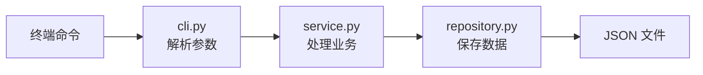
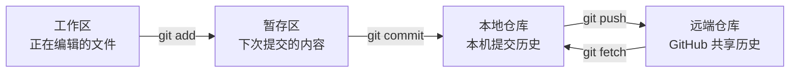

# 🎯 第 1 课：环境、项目与 Git 基本原理

企业接手一个仓库时，第一步不是立即改代码，而是确认终端位置、项目用途、运行方式和测试基线。本课所有 Git 操作都是只读的，不会修改文件或提交。

## 🎯 本课完成标准

- 能在 PowerShell 进入项目目录
- 能运行 TeamFlow 命令行程序
- 看到 7 个测试通过
- 分清工作区、暂存区、本地仓库、远端仓库
- 能读懂最基本的 `git status`

## 🖥️ 1. 先认识 PowerShell

PowerShell 是 Windows 上执行开发命令的终端。打开后可能看到：

```text
PS C:\Users\你的用户名>
```

这是提示符，不是命令。只输入 `>` 右边的命令内容，不要把 `PS C:\Users\你的用户名>` 一起复制。

| 屏幕内容 | 含义 | 是否输入 |
|---|---|---|
| `PS C:\Users\name>` | 当前目录提示符 | ✗ |
| `cd D:\pycode\git\git-learning` | 命令 | ✓ |
| `Path D:\pycode\git\git-learning` | 程序输出 | ✗ |

进入项目：

```powershell
cd D:\pycode\git\git-learning
Get-Location
```

预期 `Path` 为：

```text
D:\pycode\git\git-learning
```

查看目录：

```powershell
Get-ChildItem
```

应该看到 `src`、`tests`、`docs`、`README.md`、`pyproject.toml` 等名称。

> 💡 **一句话总结**：终端不会自动知道你要操作哪个项目；`cd` 决定后续命令在哪个目录执行。

## 🧰 2. 确认开发工具

执行：

```powershell
git --version
python --version
```

具体小版本可以不同，合格输出类似：

```text
git version 2.51.0.windows.2
Python 3.12.7
```

Git 需要 2.x，Python 需要 3.11 或更高。如果提示 `not recognized`，说明工具没有正确安装或没有加入 PATH，先查看[报错急救手册](TROUBLESHOOTING.md)。

## 🧩 3. TeamFlow 项目是做什么的

TeamFlow 是一个小型工单管理器，可以创建工单、指定负责人、列出工单和关闭工单。项目虽小，但包含企业项目常见的源代码、测试、CI、PR 模板和文档。



| 目录或文件 | 用途 | 当前要求 |
|---|---|---|
| `src/teamflow/` | Python 源代码 | 先知道位置 |
| `tests/` | 自动化测试 | 先会运行 |
| `data/` | 本地工单数据 | 知道不会提交 |
| `docs/` | 学习文档 | 当前主要入口 |
| `.github/` | PR、Issue、CI 配置 | 第 4 课学习 |
| `pyproject.toml` | 安装与命令配置 | 第 3 课学习 |

## ▶️ 4. 安装并运行项目

在项目根目录执行：

```powershell
python -m pip install --no-deps -e .
```

逐段理解：

| 部分 | 含义 |
|---|---|
| `python -m pip` | 使用当前 Python 的包管理器 |
| `install` | 安装项目 |
| `--no-deps` | 不下载第三方依赖 |
| `-e` | 可编辑安装，修改源码后立即生效 |
| `.` | 当前目录 |

成功输出末尾包含：

```text
Successfully installed teamflow-git-learning-0.1.0
```

查看程序帮助：

```powershell
teamflow --help
```

预期看到四个子命令：

```text
add
list
assign
close
```

## 🧪 5. 完成一次工单流转

按顺序执行：

```powershell
teamflow --db data/course01.json add "学习运行 TeamFlow" --priority high
teamflow --db data/course01.json assign 1 "broshenn"
teamflow --db data/course01.json list
teamflow --db data/course01.json close 1
teamflow --db data/course01.json list --status closed
```

输出应依次出现 `created`、`assigned`、`closed`，最后一行包含：

```text
#1 [closed] [high] 学习运行 TeamFlow (owner: broshenn)
```

这里的 `--db data/course01.json` 指定本课独立数据文件。文件被 `.gitignore` 排除，不会进入提交历史。

## ✅ 6. 建立测试基线

执行：

```powershell
./scripts/check.ps1
```

成功结果包含：

```text
Ran 7 tests

OK
```

企业开发中，修改代码前先运行测试，可以确认当前版本本来就是正常的。修改后再运行，如果失败，问题大概率来自新改动。

## 🗺️ 7. Git 的四个区域

Git 最关键的基础是知道变化位于哪里。



| 区域 | 保存内容 | 查看命令 | 团队能看到吗 |
|---|---|---|---|
| 工作区 | 刚编辑、尚未选择的变化 | `git diff` | ✗ |
| 暂存区 | 下次 commit 准备记录的变化 | `git diff --staged` | ✗ |
| 本地仓库 | 已 commit 的本机历史 | `git log` | ✗ |
| 远端仓库 | 已 push 的共享历史 | GitHub 或远端分支 | ✓ |

四个动词一定要分清：

- `add`：选择下次提交包含什么。
- `commit`：把暂存内容保存为本地历史。
- `push`：把本地提交发送到远端。
- `fetch`：从远端下载最新分支信息，不修改工作区。

## 🔍 8. 读懂 git status

执行：

```powershell
git status
```

理想输出：

```text
On branch main
Your branch is up to date with 'origin/main'.
nothing to commit, working tree clean
```

逐句解释：

| 输出 | 含义 |
|---|---|
| `On branch main` | 当前位于 main 分支 |
| `up to date with origin/main` | 本地主线与已知远端主线一致 |
| `nothing to commit` | 暂存区没有待提交内容 |
| `working tree clean` | 工作区没有被 Git 跟踪的变化 |

刚才创建了 `data/course01.json`，但 status 仍然干净，因为 `.gitignore` 的 `data/*.json` 规则把运行数据排除了。

再执行三条只读命令：

```powershell
git status --short
git log --oneline --graph --decorate --all -12
git remote -v
```

- `status --short` 没有输出表示干净。
- `log` 展示提交与分支关系。
- `remote -v` 应显示 GitHub 仓库地址。

## 🚨 9. 常见错误

| 现象 | 常见原因 | 当前处理 |
|---|---|---|
| `not a git repository` | 当前目录错误 | 重新执行 `cd` 和 `Get-Location` |
| 找不到 `teamflow` | 安装未成功 | 重新执行 pip 安装命令 |
| 测试不是 7 个 | 仓库内容已有变化 | 保存 `git status` 输出 |
| JSON 解析错误 | 练习数据被手工改坏 | 换一个新的 `--db` 文件名 |
| status 显示修改 | 工作区不是基线状态 | 不要直接清除，先执行 `git diff` |

## ✅ 10. 本课检查点

不看答案，先回答：

1. `git add` 后变化在哪里？
2. `git commit` 后、push 前，GitHub 能看到吗？
3. `git diff` 和 `git diff --staged` 分别看什么？
4. 为什么 `course01.json` 没出现在 status？

答案：暂存区；不能；未暂存差异与已暂存差异；它被 `.gitignore` 排除。

满足以下条件进入第 2 课：

- [ ] 位于正确项目目录
- [ ] TeamFlow 可以运行
- [ ] 7 个测试通过
- [ ] `git status` 能正常输出
- [ ] 可以不看图说出四个区域

下一课：[第一次提交与分支开发](02-COMMIT-AND-BRANCH.md)。

