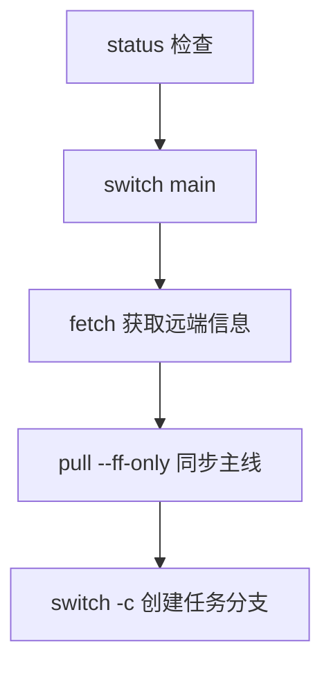
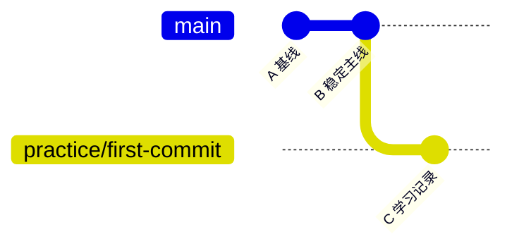

# 🎯 第 2 课：第一次提交与分支开发

本课会真正修改文件，但所有操作都在 `practice/first-commit` 分支完成，不直接修改 `main`。同一个修改会依次经过工作区、暂存区和本地仓库，让第 1 课的四区域模型变成实际经验。

## 🎯 本课完成标准

- 从最新 main 创建练习分支
- 使用 status 和 diff 检查修改
- 精确暂存一个文件
- 创建第一个规范 commit
- 会查看、切换和安全删除分支

## 🛡️ 1. 任何任务都从检查状态开始

```powershell
cd D:\pycode\git\git-learning
git status
```

如果输出不是 `working tree clean`，先运行：

```powershell
git status --short
git diff
```

不要为了得到干净状态而直接删除或重置。先确认现有修改是不是自己的重要工作。

工作区干净后执行：

```powershell
git switch main
git fetch origin
git pull --ff-only
git switch -c practice/first-commit
```

这些命令组成企业每日开始任务的固定流程：



确认当前分支：

```powershell
git branch --show-current
```

必须输出：

```text
practice/first-commit
```

## 🌿 2. 分支到底是什么

分支不是复制整个项目，而是指向某个提交的可移动名称。功能分支新增提交时，main 仍指向原来的稳定提交。



常见命名：

| 前缀 | 用途 | 示例 |
|---|---|---|
| `feature/` | 新功能 | `feature/filter-by-owner` |
| `fix/` | 普通缺陷 | `fix/empty-title` |
| `hotfix/` | 线上紧急修复 | `hotfix/json-corruption` |
| `docs/` | 纯文档 | `docs/install-guide` |
| `practice/` | 课程练习 | `practice/first-commit` |

## ✏️ 3. 修改学习记录文件

打开文件：

```powershell
notepad learning\PROGRESS.md
```

在“学习者记录”表格中增加一行，例如：

```text
| broshenn | 第 2 课 | 2026-07-21 | 正在学习第一次提交 |
```

保存并关闭记事本。然后执行：

```powershell
git status --short
```

预期看到：

```text
 M learning/PROGRESS.md
```

右侧的 `M` 表示文件在工作区被修改，但尚未暂存。

## 🔍 4. 提交前第一次检查：git diff

```powershell
git diff -- learning/PROGRESS.md
```

阅读规则：

- `+` 开头表示新增行。
- `-` 开头表示删除行。
- 没有符号的是上下文。
- `@@` 后面表示差异所在行号。

确认只有预期的一行新增。如果整篇文件都变化或出现乱码，先修正文件，不要继续 add。

## 📥 5. 精确暂存文件

```powershell
git add learning/PROGRESS.md
git status --short
```

预期变成：

```text
M  learning/PROGRESS.md
```

`M` 移到左侧，说明内容已进入暂存区。

此时运行：

```powershell
git diff
```

应该没有输出，因为没有未暂存差异。正确查看暂存内容：

```powershell
git diff --staged
```

> 💡 **一句话总结**：commit 之前最后一道人工质量门是 `git diff --staged`，它展示即将进入历史的准确内容。

## 💾 6. 创建第一次本地提交

```powershell
git commit -m "docs: record first Git learning checkpoint"
```

成功输出类似：

```text
[practice/first-commit abc1234] docs: record first Git learning checkpoint
 1 file changed, 1 insertion(+)
```

检查：

```powershell
git status
git log --oneline --decorate -3
```

status 应该干净，log 最新一行是刚才的提交。

## 📝 7. 企业提交信息怎样写

本仓库使用 Conventional Commits 的简化格式：

```text
类型: 简短说明
```

| 类型 | 何时使用 | 示例 |
|---|---|---|
| `feat` | 新功能 | `feat: filter tickets by owner` |
| `fix` | 缺陷修复 | `fix: reject empty ticket owner` |
| `test` | 只改测试 | `test: cover owner filtering` |
| `docs` | 只改文档 | `docs: explain conflict workflow` |
| `refactor` | 行为不变的重构 | `refactor: extract ticket formatter` |
| `ci` | CI 配置 | `ci: test Python 3.13` |
| `chore` | 其他维护 | `chore: update repository metadata` |

不要写：

```text
update
修改代码
test
完成了
```

这些信息无法让评审者知道变更目的。

## 👤 8. 如果 Git 提示身份未知

每个提交记录作者。只配置当前仓库：

```powershell
git config user.name "broshenn"
git config user.email "99480791+broshenn@users.noreply.github.com"
```

检查来源：

```powershell
git config --list --show-origin
```

公司项目通常使用企业邮箱，个人开源项目可以使用 GitHub 提供的 noreply 邮箱。

## ↔️ 9. 查看与切换分支

```powershell
git branch
git branch -a
```

- `git branch` 显示本地分支。
- `git branch -a` 同时显示远端跟踪分支。
- `*` 标记当前分支。

暂时回到 main：

```powershell
git switch main
```

打开 `learning/PROGRESS.md` 会发现刚才新增的行不在 main 中，因为它只属于练习分支。

再切回来：

```powershell
git switch practice/first-commit
```

新增行会重新出现。这就是分支隔离。

## 🧹 10. 怎样安全删除分支

本课暂时保留 `practice/first-commit`，用来观察自己的第一个提交。以后确认不要时：

```powershell
git switch main
git branch -d practice/first-commit
```

小写 `-d` 会在分支尚未合并时拒绝删除，避免误丢提交。大写 `-D` 会强制删除，入门阶段不要使用。

## 🚨 11. 常见错误

| 情况 | 原因 | 安全处理 |
|---|---|---|
| 分支名已存在 | 以前创建过 | `git switch practice/first-commit` |
| add 了错误文件 | 暂存范围过大 | `git restore --staged <文件>` |
| commit 后 GitHub 没变化 | 只创建了本地提交 | 正常，第 4 课学习 push |
| 切换分支被拒绝 | 未提交修改可能被覆盖 | 先 status，不要强制切换 |
| status 干净 | 修改已经提交 | 正常，使用 log 查看 |

## ✅ 12. 本课检查点

执行：

```powershell
git switch practice/first-commit
git status
git log --oneline --decorate -3
git show --stat HEAD
```

成功标准：

- [ ] 当前分支为 `practice/first-commit`
- [ ] 工作区干净
- [ ] HEAD 是自己的 docs 提交
- [ ] 提交只修改 `learning/PROGRESS.md`
- [ ] 能解释 `git diff` 和 `git diff --staged`
- [ ] 能说出每天开始任务的五步流程

完成后切回 main，为下一课准备：

```powershell
git switch main
```

下一课：[开发一个真实功能](03-REAL-FEATURE.md)。

