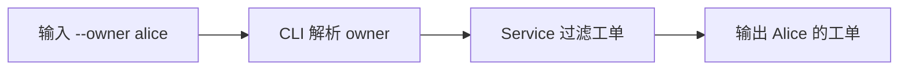
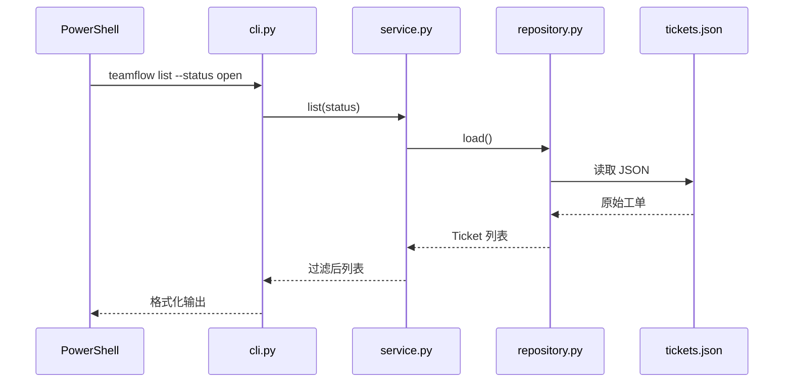

# 🎯 第 3 课：像企业开发者一样完成真实功能

本课不再只修改学习记录，而是给 TeamFlow 增加真实能力：`teamflow list --owner alice`。开发过程会经历需求分析、读代码、写测试、实现功能、手工验证和规范提交。

如果 Python 代码暂时看不懂，不需要先系统学完整门语言。先按调用链理解“参数从哪里进、业务在哪里处理、结果在哪里输出”。

## 🎯 本课完成标准

- 从最新 main 创建 `feature/filter-by-owner`
- 看懂 TeamFlow 的四层调用链
- 增加 owner 过滤和 3 个测试
- 全部 10 个测试通过
- 创建一个范围清晰的功能提交

## 📋 1. 先把需求写成验收标准

企业需求不能只写“增加负责人搜索”，因为每个人可能理解不同。本课验收标准是：

1. `teamflow list --owner alice` 只显示 owner 为 `alice` 的工单。
2. `--owner` 可以和 `--status` 同时使用。
3. owner 参数忽略首尾空格，但大小写敏感。
4. 没有匹配项时输出 `no tickets`。
5. 原有 7 个测试继续通过，新增 3 个测试。



> 💡 **一句话总结**：先定义可验证结果，再开始改代码；测试就是把验收标准变成程序可以重复执行的检查。

## 🌿 2. 创建真实功能分支

第 2 课的练习提交保留在 `practice/first-commit`，不要把它混进真实功能。执行：

```powershell
git status
git switch main
git fetch origin
git pull --ff-only
git switch -c feature/filter-by-owner
git branch --show-current
```

最后必须输出：

```text
feature/filter-by-owner
```

运行基线测试：

```powershell
./scripts/check.ps1
```

修改前应有 7 个测试通过。

## 🗺️ 3. 看懂项目代码地图

一次 `teamflow list` 命令经过下面的文件：



| 文件 | 当前责任 | 本功能是否修改 |
|---|---|---|
| `models.py` | 定义 Ticket、Priority、Status | ✗ |
| `repository.py` | 从 JSON 读写 Ticket | ✗ |
| `service.py` | 业务过滤 | ✓ |
| `cli.py` | 接收 `--owner` 参数 | ✓ |
| `test_service.py` | 验证过滤规则 | ✓ |
| `test_cli.py` | 验证用户命令行为 | ✓ |

先打开项目：

```powershell
code .
```

如果 `code` 不可用，使用：

```powershell
explorer .
```

## 🧪 4. 先增加业务层测试

打开 `tests/test_service.py`。在 `test_list_filters_by_status` 方法结束后、`test_unknown_ticket_raises_domain_error` 之前，加入下面两个完整测试方法：

```python
    def test_list_filters_by_owner(self) -> None:
        """Owner filtering returns only tickets assigned to that owner."""

        alice_ticket = self.service.create("修复登录超时", Priority.HIGH)
        bob_ticket = self.service.create("增加导出功能", Priority.MEDIUM)
        self.service.assign(alice_ticket.id, "alice")
        self.service.assign(bob_ticket.id, "bob")

        owner_tickets = self.service.list(owner="  alice  ")

        self.assertEqual(1, len(owner_tickets))
        self.assertEqual("修复登录超时", owner_tickets[0].title)

    def test_list_combines_status_and_owner_filters(self) -> None:
        """Status and owner filters are both applied when provided."""

        closed_ticket = self.service.create("修复支付回调", Priority.HIGH)
        open_ticket = self.service.create("补充接口监控", Priority.MEDIUM)
        self.service.assign(closed_ticket.id, "alice")
        self.service.assign(open_ticket.id, "alice")
        self.service.close(closed_ticket.id)

        matching = self.service.list(status=Status.OPEN, owner="alice")

        self.assertEqual(1, len(matching))
        self.assertEqual("补充接口监控", matching[0].title)
```

保存后运行：

```powershell
./scripts/check.ps1
```

此时测试应该失败，核心错误类似：

```text
TypeError: TicketService.list() got an unexpected keyword argument 'owner'
```

这是预期失败：测试已经描述新需求，但产品代码还不支持 `owner`。确认失败原因正确后继续实现。

## ⚙️ 5. 实现业务过滤

打开 `src/teamflow/service.py`，找到现有 `list` 方法，用下面的完整方法替换：

```python
    def list(
        self,
        status: Status | None = None,
        owner: str | None = None,
    ) -> list[Ticket]:
        """Return tickets, optionally filtered by status and owner."""

        tickets = self.repository.load()
        if status is not None:
            tickets = [ticket for ticket in tickets if ticket.status == status]
        if owner is not None:
            normalized_owner = owner.strip()
            tickets = [
                ticket for ticket in tickets if ticket.owner == normalized_owner
            ]
        return tickets
```

这个方法按顺序做三件事：

1. 从仓库加载全部工单。
2. 提供 status 时按状态过滤。
3. 提供 owner 时去掉参数首尾空格，再按负责人过滤。

再次运行测试：

```powershell
./scripts/check.ps1
```

现在业务层新增测试应该通过，但总测试数还是 9，因为命令行层还没有增加测试。

## ⌨️ 6. 给 CLI 增加 --owner 参数

打开 `src/teamflow/cli.py`，找到创建 `list_parser` 的代码。在现有 `--status` 参数之后加入：

```python
    list_parser.add_argument(
        "--owner",
        help="filter tickets by owner",
    )
```

然后在 `main` 函数的 `elif args.command == "list":` 分支中，把：

```python
            tickets = service.list(status)
```

替换为：

```python
            tickets = service.list(status=status, owner=args.owner)
```

使用关键字参数能明确表示哪个值传给 status、哪个值传给 owner。

## 🧪 7. 增加命令行测试

打开 `tests/test_cli.py`，在 `test_missing_ticket_returns_failure_code` 之前加入下面的完整测试方法：

```python
    def test_list_filters_by_owner(self) -> None:
        """The owner option displays only matching tickets."""

        with tempfile.TemporaryDirectory() as directory:
            database = Path(directory) / "tickets.json"
            main(["--db", str(database), "add", "修复登录超时"])
            main(["--db", str(database), "add", "补充支付监控"])
            main(["--db", str(database), "assign", "1", "alice"])
            main(["--db", str(database), "assign", "2", "bob"])

            output = io.StringIO()
            with contextlib.redirect_stdout(output):
                result = main(
                    ["--db", str(database), "list", "--owner", "alice"]
                )

        self.assertEqual(0, result)
        self.assertIn("修复登录超时", output.getvalue())
        self.assertNotIn("补充支付监控", output.getvalue())
```

保存全部文件，运行完整检查：

```powershell
./scripts/check.ps1
```

成功标准：

```text
Ran 10 tests

OK
```

## 🖐️ 8. 手工验证用户场景

使用一个新数据库文件：

```powershell
teamflow --db data/course03.json add "修复登录超时" --priority high
teamflow --db data/course03.json add "补充支付监控" --priority medium
teamflow --db data/course03.json assign 1 alice
teamflow --db data/course03.json assign 2 bob
teamflow --db data/course03.json list --owner alice
```

最后只应显示：

```text
#1 [open] [high] 修复登录超时 (owner: alice)
```

验证组合过滤：

```powershell
teamflow --db data/course03.json close 1
teamflow --db data/course03.json list --status open --owner alice
```

应输出：

```text
no tickets
```

如果以前运行过这些命令导致 ID 不是 1 和 2，改用新的数据库名，例如 `data/course03-second.json`。

## 🔍 9. 提交前做三层检查

第一层，检查涉及文件：

```powershell
git status --short
git diff --stat
```

应该只有 4 个文件：

```text
src/teamflow/cli.py
src/teamflow/service.py
tests/test_cli.py
tests/test_service.py
```

第二层，检查具体代码：

```powershell
git diff
```

第三层，暂存后检查最终提交：

```powershell
git add src/teamflow/cli.py src/teamflow/service.py tests/test_cli.py tests/test_service.py
git diff --staged
./scripts/check.ps1
```

确认没有调试输出、无关格式化和本地数据文件。

## 💾 10. 创建功能提交

```powershell
git commit -m "feat: filter tickets by owner"
git status
git show --stat HEAD
```

理想结果：工作区干净，最新提交修改 4 个文件，并且功能代码与测试一起存在。

## 🚨 11. 常见错误

| 现象 | 原因 | 检查位置 |
|---|---|---|
| `args has no attribute owner` | 忘记给 list_parser 添加参数 | `cli.py` 的 parser 部分 |
| 仍显示 Bob 工单 | CLI 没把 owner 传给 service | `service.list(...)` 调用 |
| status 过滤失效 | 实现时过早 return | `service.py` list 方法 |
| 缩进错误 | Python 代码层级不正确 | 对照原文件 4 空格缩进 |
| 测试少于 10 | 测试方法放在类外或未保存 | `test_service.py`、`test_cli.py` |

## ✅ 12. 本课检查点

```powershell
git branch --show-current
git status
git log --oneline -3
./scripts/check.ps1
```

必须满足：

- [ ] 当前分支为 `feature/filter-by-owner`
- [ ] 工作区干净
- [ ] 最新提交为 `feat: filter tickets by owner`
- [ ] 10 个测试全部通过
- [ ] 手工命令只能看到目标负责人
- [ ] 能说清 CLI → Service → Repository 调用链

下一课：[Push、PR、Review、CI 与冲突](04-TEAM-COLLABORATION.md)。

