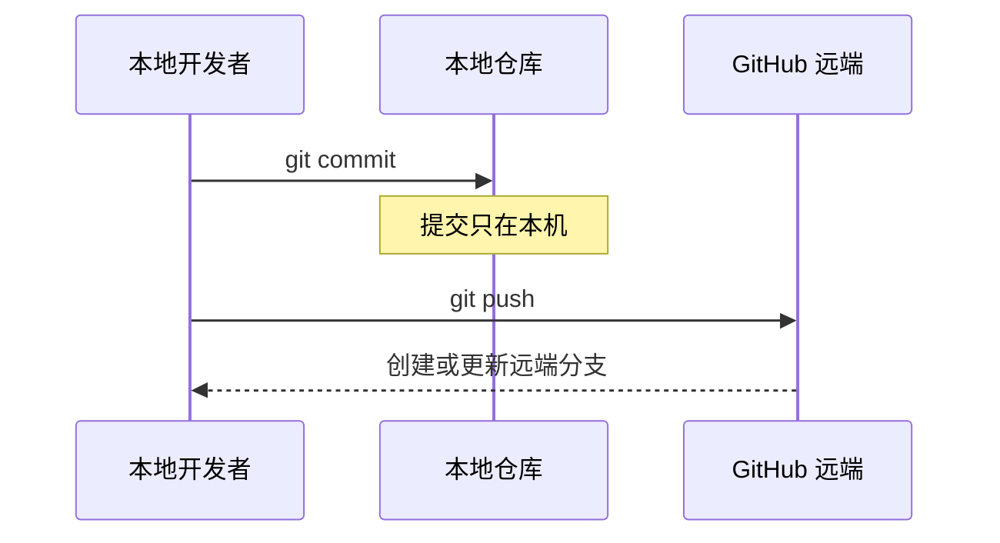
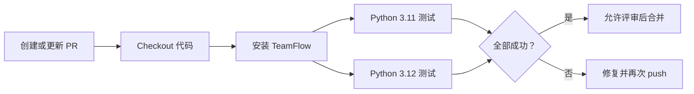
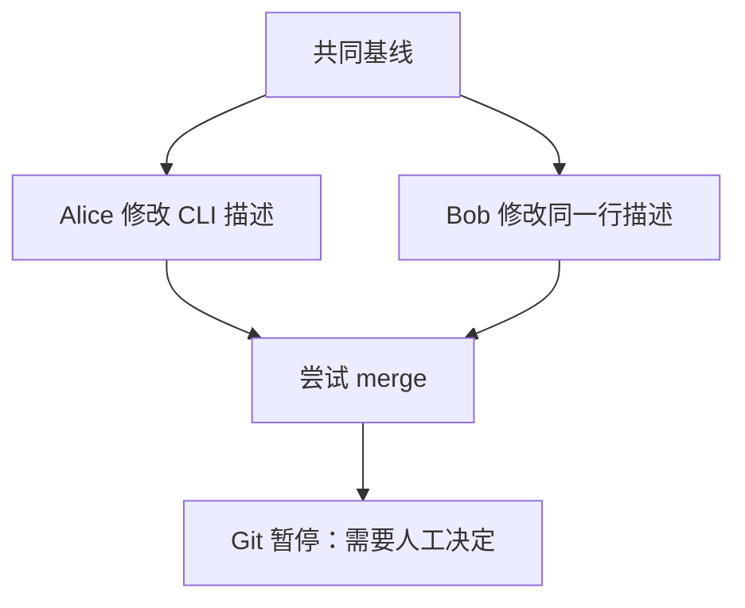

# 🎯 第 4 课：Push、Pull Request、Review、CI 与冲突

第 3 课的功能提交目前只存在于本地电脑。本课会把它推送到 GitHub，通过 Pull Request 展示变更，让自动化测试和代码评审成为合并条件，最后使用仓库内置分支完成一次可重复的真实冲突实验。

## 🎯 本课完成标准

- 分清本地分支、远端跟踪分支和 GitHub 分支
- 推送 `feature/filter-by-owner`
- 创建并填写一个完整 Pull Request
- 看懂 GitHub Actions 的两个测试任务
- 合并 PR 并同步本地 main
- 独立解决一次真实内容冲突

## ☁️ 1. commit 与 push 的边界

`commit` 只更新本地仓库，`push` 才请求远端更新分支。



先确认第 3 课状态：

```powershell
cd D:\pycode\git\git-learning
git switch feature/filter-by-owner
git status
git log --oneline -3
./scripts/check.ps1
```

要求：工作区干净、最新提交是 owner 过滤、10 个测试通过。

## 🚀 2. 第一次推送功能分支

执行：

```powershell
git push -u origin HEAD
```

逐段解释：

| 部分 | 含义 |
|---|---|
| `push` | 把本地提交发送到远端 |
| `-u` | 建立本地与远端分支的跟踪关系 |
| `origin` | GitHub 远端别名 |
| `HEAD` | 当前分支当前提交 |

成功输出包含：

```text
[new branch] feature/filter-by-owner -> feature/filter-by-owner
```

GitHub 还可能输出一个创建 Pull Request 的网址。

再次查看：

```powershell
git status
git branch -vv
```

当前分支旁边应出现 `[origin/feature/filter-by-owner]`。以后在同一分支继续提交，只需执行 `git push`。

> 💡 **一句话总结**：`-u` 只需在第一次推送分支时使用，它告诉 Git 后续默认推向哪个远端分支。

## 📝 3. 先创建一个 GitHub Issue

打开仓库：

[https://github.com/broshenn/git-learning](https://github.com/broshenn/git-learning)

按以下顺序操作：

1. 点击 `Issues`。
2. 点击 `New issue`。
3. 选择“功能需求”模板。
4. 标题填写：`[Feature] 支持按负责人过滤工单`。
5. 问题说明：团队需要快速查看某位成员负责的工单。
6. 验收标准填写第 3 课的五条标准。
7. 点击 `Submit new issue`。

记下 Issue 编号，例如 `#1`。真实企业开发通常先有 Issue 或项目任务，再创建代码分支和 PR。

## 🔀 4. 创建 Pull Request

回到仓库首页。GitHub 通常会显示刚推送分支的 `Compare & pull request` 按钮。也可以进入 `Pull requests` → `New pull request`，选择：

```text
base: main
compare: feature/filter-by-owner
```

这表示请求把功能分支的变化合入 main。

标题填写：

```text
feat: filter tickets by owner
```

正文按照仓库模板填写：

```markdown
## 变更说明

为 list 命令增加 --owner 参数，支持按负责人过滤工单，并可与 --status 组合使用。

## 关联任务

Closes #1

## 验证方式

- [x] ./scripts/check.ps1
- [x] 新增 owner、组合过滤、CLI 三个测试
- [x] 手工验证无匹配结果输出 no tickets

## 风险与回滚

只扩展 list 的可选参数，不改变现有命令默认行为。出现问题可 revert 本 PR 的合并提交。

## 提交前检查

- [x] PR 只解决 owner 过滤
- [x] 没有本地 JSON 数据或敏感信息
- [x] 文档与行为一致
```

将 `#1` 替换为自己的真实 Issue 编号，然后点击 `Create pull request`。

## 🤖 5. 看懂 CI

PR 创建后，`.github/workflows/ci.yml` 会触发 GitHub Actions。



PR 页面 `Checks` 区域会出现两个任务：

```text
test (3.11)
test (3.12)
```

| 状态 | 含义 | 动作 |
|---|---|---|
| 黄色圆点 | 正在运行 | 等待 |
| 绿色对勾 | 检查成功 | 可以继续 Review |
| 红色叉号 | 检查失败 | 点击任务查看失败步骤 |

CI 通过只说明自动检查通过，不代表代码一定正确；Review 还要检查需求理解、可读性、风险和维护成本。

## 👀 6. Review 到底看什么

打开 PR 的 `Files changed` 页面，像评审者一样检查：

1. 是否只修改预期的 4 个文件？
2. owner 首尾空格是否处理？
3. status 与 owner 是否可以组合？
4. 原有调用是否保持兼容？
5. 三个新增测试是否覆盖验收标准？
6. 是否误提交 `data/*.json`、调试输出或敏感信息？

企业 Review 不是挑错比赛。意见应具体、可验证，例如：

```text
建议使用关键字参数调用 service.list，这样 status 与 owner 的位置更清楚。
```

不要写模糊意见：

```text
这里不太好。
```

## 🔁 7. 收到修改意见后怎样更新 PR

假设评审要求在帮助信息中说明 owner 会忽略首尾空格。仍然在原分支修改，不要新建 PR：

```powershell
git switch feature/filter-by-owner
git status
```

修改对应代码后：

```powershell
git diff
./scripts/check.ps1
git add src/teamflow/cli.py
git diff --staged
git commit -m "docs(cli): clarify owner filter behavior"
git push
```

push 后原 PR 会自动增加提交并重新运行 CI。不要关闭旧 PR 再开一个。

## ✅ 8. 合并 Pull Request

确认：

- CI 全绿
- 文件范围正确
- Review 意见已处理
- PR 没有冲突

点击 `Merge pull request`，本课程建议选择 **Create a merge commit**，这样可以在历史图中看到功能分支。确认合并后，Issue 会因为 `Closes #编号` 自动关闭。

三种常见策略：

| 策略 | 结果 | 适合场景 |
|---|---|---|
| Merge commit | 保留分支结构和全部提交 | 教学、重要功能脉络 |
| Squash and merge | 整个 PR 变成一个提交 | 小功能、主线简洁 |
| Rebase and merge | 提交线性进入 main | 原提交质量高的团队 |

仓库需要统一策略，不是每个开发者随意选择。

## 🧹 9. 合并后的本地清理

GitHub 合并后，本地 main 不会自动变化。执行：

```powershell
git switch main
git pull --ff-only
git log --oneline --graph --decorate --all -12
./scripts/check.ps1
```

现在 main 应包含 owner 功能，并有 10 个测试。

安全删除已合并本地分支：

```powershell
git branch -d feature/filter-by-owner
git fetch --prune
```

如果 GitHub 已自动删除远端分支，`fetch --prune` 会清理本地过期的远端跟踪名称。

## 💥 10. 为什么会产生冲突

当两个分支修改同一文件的同一位置，而 Git 无法自动判断最终内容时，就会产生内容冲突。冲突不是仓库损坏，而是需要开发者做业务决定。



## 🧪 11. 使用内置分支制造真实冲突

先确认 main 干净：

```powershell
git switch main
git status
git fetch origin
```

从 Alice 实验分支创建本地练习分支：

```powershell
git switch -c practice/resolve-conflict origin/lab/conflict-alice
git merge origin/lab/conflict-bob
```

预期输出：

```text
CONFLICT (content): Merge conflict in src/teamflow/cli.py
Automatic merge failed; fix conflicts and then commit the result.
```

查看状态：

```powershell
git status
git diff
```

冲突文件中会出现三组标记。下面为了避免被文档检查误判，在符号之间加入了空格；真实文件中符号是连续的：

```text
< < < < < < < HEAD
Alice 分支内容
= = = = = = =
Bob 分支内容
> > > > > > > origin/lab/conflict-bob
```

`HEAD` 一侧是当前练习分支内容，另一侧是正在合并的 Bob 分支内容。

## 🛠️ 12. 正确解决冲突

打开 `src/teamflow/cli.py`：

```powershell
code src\teamflow\cli.py
```

如果 code 不可用：

```powershell
notepad src\teamflow\cli.py
```

不要简单选择“谁最后提交就听谁的”。本实验把两边意图合并成一句话，最终保留：

```python
        description="Manage TeamFlow tickets, incidents, and feature requests.",
```

删除全部冲突标记和两条旧描述，保存文件。检查：

```powershell
git diff --check
git status
git add src/teamflow/cli.py
git status
```

状态应从 `both modified` 变为 `Changes to be committed`。完成合并提交：

```powershell
git commit -m "merge: resolve CLI description conflict"
./scripts/check.ps1
git log --oneline --graph --decorate --all -12
```

实验分支基于早期课程版本，因此这里显示 7 个测试属于正常现象。这个练习分支不要合入 main。

## ↩️ 13. 冲突过程中想放弃怎么办

如果尚未提交合并结果：

```powershell
git merge --abort
```

它会回到执行 merge 之前的状态。已经完成合并提交后，不要再执行 `merge --abort`。

练习结束后回到 main：

```powershell
git switch main
git status
```

`practice/resolve-conflict` 可以暂时保留，方便以后查看冲突历史。

## 🚨 14. 常见错误

| 现象 | 原因 | 安全处理 |
|---|---|---|
| push 要求登录 | GitHub 凭证未配置 | 按浏览器提示登录，不输入账号密码到代码文件 |
| PR 没有变化 | base 与 compare 选反或分支未推送 | base 选 main，compare 选功能分支 |
| CI 失败 | 测试或安装步骤失败 | 点击红色任务看第一个失败步骤 |
| merge 后本地 main 没功能 | 本地尚未 pull | switch main 后 pull --ff-only |
| 冲突标记仍存在 | 文件没有清理完整 | 搜索连续的 `<`、`=`、`>` 标记 |
| `git add` 后冲突仍未解决 | 还有其他冲突文件 | 查看 `git status` |

## ✅ 15. 本课检查点

- [ ] 能解释 commit 和 push 的区别
- [ ] GitHub 上有一个完整 PR 记录
- [ ] 看懂 Python 3.11、3.12 两个 CI 任务
- [ ] PR 已合并，main 包含 owner 功能
- [ ] 本地 main 已同步并通过 10 个测试
- [ ] 冲突实验成功出现、解决并提交
- [ ] 知道提交前如何放弃 merge

下一课：[撤销救援、进阶工具与发布](05-RECOVERY-AND-RELEASE.md)。

