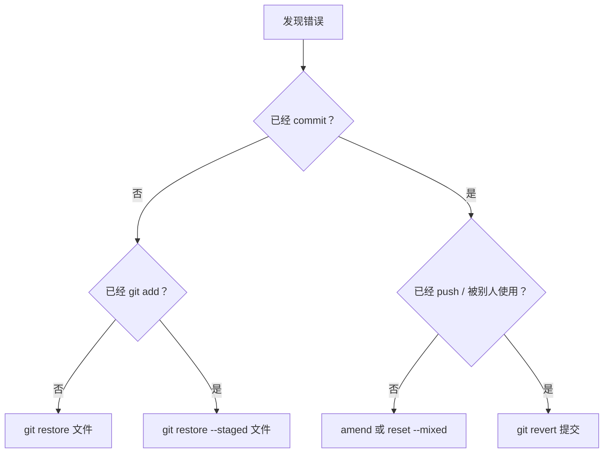
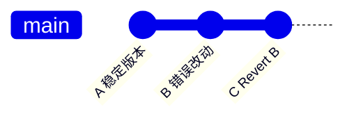
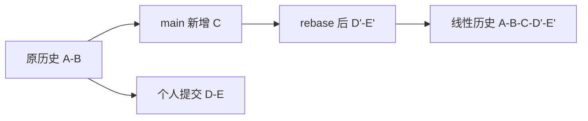
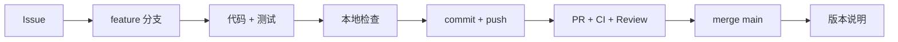

# 🎯 第 5 课：撤销救援、进阶工具与版本发布

真正的 Git 熟练不是永远不犯错，而是能先判断错误位于哪个区域，再选择不会伤害团队历史的恢复方法。本课把撤销、stash、rebase、cherry-pick、reflog、hotfix 和 tag 放进同一套安全决策中。

## 🎯 本课完成标准

- 根据工作区、暂存区、本地提交、远端提交选择撤销命令
- 会暂存未完成工作并恢复
- 理解 rebase 和 cherry-pick 的适用边界
- 会用 reflog 找到移动前的 HEAD
- 能描述 hotfix 和版本发布流程
- 独立完成毕业任务

## 🛡️ 1. 撤销前先定位错误区域

遇到错误先执行：

```powershell
git status
git log --oneline --decorate -8
```

不要条件反射输入 `git reset --hard`。先用下面的决策图：



| 错误位置 | 想达到的结果 | 推荐命令 | 是否改写历史 |
|---|---|---|---|
| 工作区 | 丢弃未暂存修改 | `git restore <file>` | 否 |
| 暂存区 | 取消暂存，保留文件修改 | `git restore --staged <file>` | 否 |
| 最近本地提交 | 补文件或改提交说明 | `git commit --amend` | ✓ |
| 最近本地提交 | 拆掉提交，保留工作区修改 | `git reset --mixed HEAD~1` | ✓ |
| 已共享提交 | 公开撤销改动 | `git revert <commit>` | 否，新增提交 |
| 分支指针移动错误 | 找到旧 HEAD | `git reflog` | 只读查询 |

> 💡 **一句话总结**：未共享历史可以整理，已共享历史优先新增 revert 提交，不要让队友依赖的提交突然消失。

## 🧪 2. 建立安全恢复实验分支

确保 main 干净：

```powershell
cd D:\pycode\git\git-learning
git switch main
git status
git switch -c practice/recovery-lab
```

所有恢复实验都在这个分支完成，不推送、不合入 main。

## ↩️ 3. 恢复未暂存修改

打开：

```powershell
notepad learning\PROGRESS.md
```

在文件末尾增加一行：

```text
这是一行专门用于 restore 实验的临时内容。
```

保存后查看：

```powershell
git diff -- learning/PROGRESS.md
```

确认这行确实不要，然后执行：

```powershell
git restore learning/PROGRESS.md
git status --short
```

临时行会消失。`restore` 丢弃未提交内容，执行前必须先读 diff；没有 commit 的内容通常无法从 Git 历史恢复。

## 📤 4. 取消错误暂存

再次在进度文件增加一行有效学习记录，保存后：

```powershell
git add learning/PROGRESS.md
git status --short
```

现在假设暂时不想把它放进下次提交：

```powershell
git restore --staged learning/PROGRESS.md
git status --short
```

文件修改仍然存在，只是从暂存区回到工作区。`--staged` 不会丢失文件内容。

重新暂存并提交：

```powershell
git add learning/PROGRESS.md
git commit -m "docs: record recovery lesson"
```

## ✍️ 5. 修正最近一次本地提交

刚才的提交尚未 push，可以修改提交信息：

```powershell
git commit --amend -m "docs: record Git recovery lesson"
git log --oneline -2
```

amend 不是编辑原提交，而是创建一个新提交并让分支指向它，所以哈希会改变。

适用条件：提交还没有被别人依赖。已经推送到公共分支时，不要随意 amend 后强推。

## 🔙 6. 用 revert 安全撤销共享思想

在实验分支模拟“提交已经公开，不能改历史”：

```powershell
git revert HEAD
```

Git 可能打开提交信息编辑器，保留默认的 `Revert "docs: record Git recovery lesson"`，保存并关闭。若希望直接使用默认信息：

```powershell
git revert HEAD --no-edit
```

注意只能执行其中一种方式，不要两条都执行。

查看：

```powershell
git log --oneline -3
git diff HEAD~2..HEAD
```

历史中同时保留原提交和 revert 提交，最终文件内容回到原状态。这给团队留下完整审计记录。



## 📦 7. stash：临时切换紧急任务

stash 适合尚未形成完整提交、但必须马上切换分支的工作。

在 `learning/PROGRESS.md` 末尾增加：

```text
这是一行尚未完成、准备放入 stash 的内容。
```

然后执行：

```powershell
git status --short
git stash push -u -m "wip: recovery lesson notes"
git status
git stash list
```

`-u` 会同时收起未跟踪文件，`-m` 给 stash 写清说明。status 应变干净，列表包含：

```text
stash@{0}: On practice/recovery-lab: wip: recovery lesson notes
```

恢复：

```powershell
git stash pop
git status --short
```

`pop` 应用并删除该 stash。如果担心冲突，先使用 `git stash apply`，确认正确后再 `git stash drop`。

实验行不需要时，确认 diff 后恢复：

```powershell
git restore learning/PROGRESS.md
```

## 🔄 8. rebase：把个人提交重放到最新 main

功能分支开发期间，main 可能出现新提交。rebase 会把个人提交暂时取下，以最新 main 为基础重新创建这些提交。



个人功能分支同步主线：

```powershell
git fetch origin
git rebase origin/main
```

如果冲突：

```powershell
git status
# 编辑冲突文件并保存
git add <冲突文件>
git rebase --continue
```

放弃整个 rebase：

```powershell
git rebase --abort
```

使用边界：

- ✓ 自己独占、尚未共享的功能分支。
- △ 自己已推送但明确没有其他人使用的分支，需要谨慎协调。
- ✗ main、发布分支、多人共同开发分支。

rebase 改变提交哈希。公共历史使用 merge 通常更安全。

## 🍒 9. cherry-pick：只取一个特定提交

cherry-pick 会把另一个分支某个提交的差异复制到当前分支，形成新的提交。

```powershell
git log --oneline --all
git cherry-pick <目标提交哈希>
```

真实场景：修复已经进入下一版本开发分支，但当前生产版本也需要同一个修复。维护者可以把那个修复提交 cherry-pick 到 hotfix 分支。

使用限制：

1. 新提交哈希与原提交不同。
2. 大量 cherry-pick 会让分支关系难追踪。
3. 必须在 PR 中记录来源提交。
4. 如果应该同步整条分支，应使用 merge 或 rebase，而不是逐个复制。

发生冲突后：

```powershell
git add <已解决文件>
git cherry-pick --continue
```

放弃：

```powershell
git cherry-pick --abort
```

## 🧭 10. reflog：找回看似消失的提交

分支被 reset、rebase 或误删后，提交可能不再出现在普通 log，但本地 reflog 会记录 HEAD 的移动。

```powershell
git reflog -10
```

找到目标哈希后先检查：

```powershell
git show <目标哈希>
```

确认无误后创建救援分支固定它：

```powershell
git switch -c rescue/lost-work <目标哈希>
```

先创建救援分支，不要立刻 reset 当前重要分支。reflog 主要是本机记录，不能假设其他电脑也有相同内容。

## 🚑 11. 企业 hotfix 流程

线上故障需要快，但仍然要留下测试、Review 和可回滚记录。


标准命令：

```powershell
git switch main
git pull --ff-only
git switch -c hotfix/short-problem-name
```

修改后：

```powershell
./scripts/check.ps1
git add <修复文件> <测试文件>
git diff --staged
git commit -m "fix: describe the production failure"
git push -u origin HEAD
```

紧急不等于直接 push main。修复范围越小，评审和回滚越容易。

## 🏷️ 12. tag 与版本发布

分支会移动，标签用于把版本号固定到一个具体提交。项目已有标签：

```powershell
git tag --list
git show v0.1.0
```

语义化版本：

| 改动 | 版本变化 | 示例 |
|---|---|---|
| 不兼容变化 | 主版本 +1 | `1.4.2 → 2.0.0` |
| 向后兼容的新功能 | 次版本 +1 | `1.4.2 → 1.5.0` |
| 向后兼容的修复 | 修订号 +1 | `1.4.2 → 1.4.3` |

在实验分支创建本地训练标签：

```powershell
git tag -a training-v1.0.0 -m "training: complete Git recovery course"
git show training-v1.0.0
```

真正发布时才推送：

```powershell
git push origin training-v1.0.0
```

本课不要推送训练标签。检查完成后删除本地标签：

```powershell
git tag -d training-v1.0.0
```

已发布标签不要移动或覆盖；版本有问题时创建新的修订版本。

## ⚠️ 13. 两条高风险命令

### reset --hard

```powershell
git reset --hard <提交>
```

它会移动分支并丢弃工作区、暂存区内容。只有完全确认无保留价值、已记录目标哈希时才考虑。普通撤销优先使用 restore、reset --mixed 或 revert。

### push --force

```powershell
git push --force
```

它可能覆盖远端公共历史，让队友的提交失去引用。企业主分支通常通过保护规则禁止。即使个人分支确需更新改写后的历史，也优先使用 `--force-with-lease`，并先确认没有他人新提交。

## 🎓 14. 毕业任务：独立增加优先级过滤

现在不再提供逐行代码。独立完成：

```text
teamflow list --priority high
```

验收标准：

1. `--priority low|medium|high` 只返回对应优先级。
2. 可以与 `--status`、`--owner` 同时使用。
3. 无匹配项输出 `no tickets`。
4. 至少新增 3 个测试。
5. 原有测试全部通过。
6. 使用 `feature/filter-by-priority` 分支。
7. PR 关联一个真实 Issue。
8. PR 中写明验证方式、风险与回滚。

完整交付链路：



允许查前四课和命令词典，但不要直接复制第 3 课的最终答案。完成后应能说明每个改动文件的责任。

## 🧹 15. 清理本课实验

确认不需要实验分支内容后：

```powershell
git switch main
git status
```

`practice/recovery-lab` 没有合入 main，安全 `-d` 会拒绝。先保留它用于复习；确认所有有价值内容都不需要后，才可以明确删除：

```powershell
git branch -D practice/recovery-lab
```

这里只允许删除自己创建且明确用于丢弃的实验分支。

## 📊 16. 全景对比

| 工具 | 解决的问题 | 是否改写提交 | 主要边界 |
|---|---|---|---|
| restore | 恢复文件或取消暂存 | 否 | 未提交内容可能丢失 |
| amend | 修正最近本地提交 | ✓ | 不用于公共历史 |
| revert | 撤销已共享提交 | 否 | 会新增反向提交 |
| stash | 临时收起未完成工作 | 否 | 不是长期备份 |
| rebase | 个人分支同步并线性化 | ✓ | 不改多人公共分支 |
| cherry-pick | 复制指定提交 | 创建新提交 | 需记录来源 |
| reflog | 查找本地 HEAD 历史 | 否 | 主要限当前电脑 |
| tag | 固定发布版本 | 否 | 已发布标签不移动 |

## ✅ 17. 课程毕业检查

- [ ] 能先判断错误所在区域再选命令
- [ ] 不会对公共 main 执行 reset --hard 后强推
- [ ] 会 stash 与恢复未完成工作
- [ ] 能解释 rebase 为什么改变哈希
- [ ] 会用 reflog 创建救援分支
- [ ] 能说清 hotfix 为什么仍需测试和 Review
- [ ] 会查看和创建带说明标签
- [ ] 能独立完成优先级过滤 PR

完成五课后，再阅读[企业 Git 进阶总览](../GIT-ENTERPRISE-TUTORIAL.md)，会发现原来抽象的术语已经能对应到实际操作。

