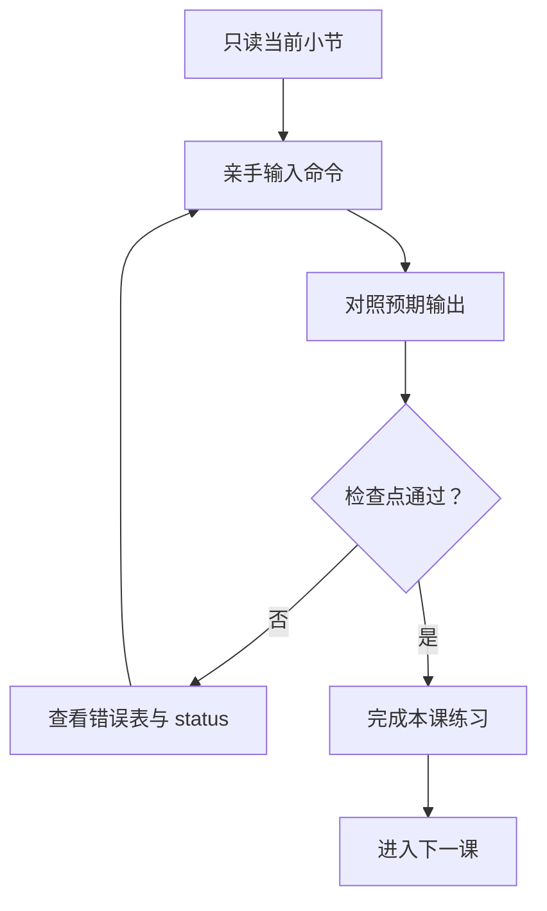

# 🎯 Git 企业开发零基础课程：5 课学会真实协作

这套课程面向第一次系统学习 Git 的开发者。课程默认使用 **Windows PowerShell**，不假设你懂终端、分支、暂存区、GitHub 或 Pull Request。

总共只有 5 课。每课内部按照“概念 → 命令 → 预期输出 → 动手练习 → 检查点”组织。不要一次读完；完成本课检查点以后再进入下一课。

## 🗺️ 五课学习路线


| 课程 | 学什么 | 最终成果 | 建议用时 |
|---|---|---|---|
| [第 1 课：环境、项目与 Git 原理](01-FOUNDATIONS.md) | PowerShell、运行项目、Git 四区域 | 看懂仓库状态，7 个测试通过 | 60 分钟 |
| [第 2 课：第一次提交与分支开发](02-COMMIT-AND-BRANCH.md) | diff、add、commit、分支、提交规范 | 在练习分支生成自己的提交 | 70 分钟 |
| [第 3 课：开发一个真实功能](03-REAL-FEATURE.md) | 读源码、改业务、补测试、小步提交 | 完成 `--owner` 过滤功能 | 90 分钟 |
| [第 4 课：Push、PR、Review、CI 与冲突](04-TEAM-COLLABORATION.md) | GitHub 企业协作完整链路 | 合并一个 PR，解决一次冲突 | 90 分钟 |
| [第 5 课：撤销救援、进阶工具与发布](05-RECOVERY-AND-RELEASE.md) | restore、revert、stash、rebase、tag | 会救代码并模拟 hotfix 发布 | 100 分钟 |

命令记不住很正常，需要时查：

- [Git 命令中文词典](COMMAND-DICTIONARY.md)
- [常见报错急救手册](TROUBLESHOOTING.md)
- [一页命令速查表](../CHEATSHEET.md)
- [企业 Git 进阶总览](../GIT-ENTERPRISE-TUTORIAL.md)

## 🧭 每一课的正确学法



学习时遵守四条安全规则：

1. 每次操作前先执行 `git status`。
2. 所有练习在 `practice/*` 或 `feature/*` 分支完成，不直接修改 `main`。
3. 看不懂错误时停止，不连续尝试 `reset --hard` 或强制推送。
4. 命令要亲手执行；输出和教程不一致时先查原因。

> 💡 **一句话总结**：真正的目标不是背下几十条命令，而是独立完成“接需求 → 建分支 → 改代码 → 测试 → 提交 → PR → 合并 → 发布”。

## 🚦现在从哪里开始

打开 PowerShell，只执行：

```powershell
cd D:\pycode\git\git-learning
git status
```

然后进入[第 1 课](01-FOUNDATIONS.md)。

